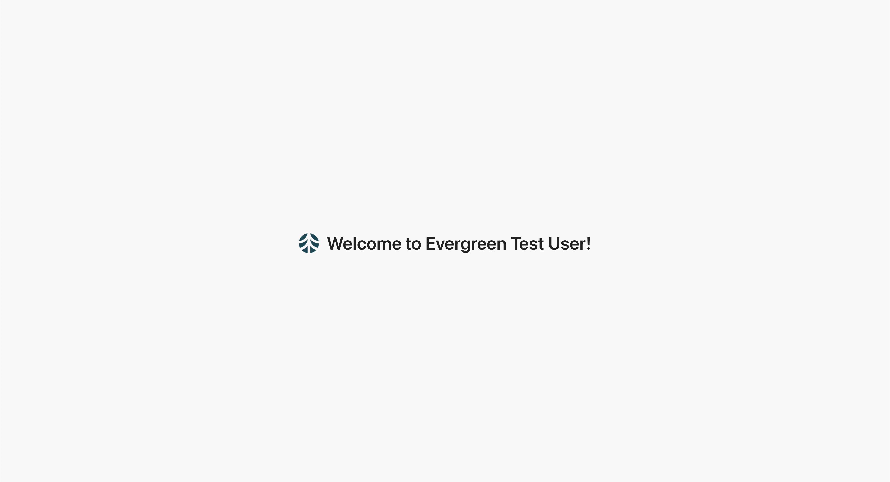

# ZJ Lin

# Delivery Notes
## Assumptions
1. No null in data. If a string attribute doesn't have value, it is given an empty string
2. Assume a defined list for vendor category
3. Assume web viewport, not built for mobile

## Design Consideration
1. I picked styled-components because it avoided messy class naming mapping and a lot other benefits of easier styling maintenance
2. Listing rules
    1. Turned off define before usage warning because code is cleaner with the most important code at the top, JS has roistering
    2. Turned off import/extensions because it still can be useful for js and jsx
3. A theme was not added because there is no theme change requirement. It could have been implemented using Context or a third party UI/navigation library
4. I practice container-presentational pattern, but the Apollo hooks seems to assume side effects is best to happen at the calling component. I would rarely put network logic at a leaf component but apparently that’s the best strategy for useMutation at CatStatusCell. I will be happy to know if there is a better way of doing this

## Personal Notes
1. I’ve not worked with the GraghQL and the backend stack before. Part of the backend code was from the short learning of the tutorials and a portion of the other part is by guessing from the existing code. Luckily they all worked. There are definitely better ways to do the backend. Feedback is really appreciated!
2. I renamed external_link to link at VendorModel because it was bugging out the endpoint. I didn’t get the time to investigate the root cause but it seems to be a bug related to the resolver naming convention.
3. The original libraries at the demo code were not removed in case you need it - some code redundancy

# Backend setup
## Create python3 virtualenv
```
python3 -m venv env
source env/bin/activate # you need to run this before running any python commands
```

## Install dependencies
```
pip install -r requirements.txt
```

## Init db
start `python` interpreter
```
from backend.init_db import init_db
init_db()
```

## Start backend server
```
PYTHONPATH=$(pwd) python backend/application.py
```
Changes to backend code are auto reloaded.

If you run into an issue like `TypeError: expected str, bytes or os.PathLike object, not NoneType`, try commenting out this [line](https://github.com/Greenbax/interview-template/blob/master/backend/application.py#L2)

# Frontend setup
## Build packages
```
npm install
```

## Start webpack dev server
In a different command line window
```
npm run start
```
Changes to frontend code are auto reloaded.

# Testing
Graphql query explorer: http://localhost:5000/graphql

Homepage: http://localhost:5000



# Recommanded readings
- React: https://reactjs.org/docs/getting-started.html
- Graphql backend (Graphene): https://graphene-python.org/
- Graphql frontend (Apollo): https://www.apollographql.com/docs/react/
